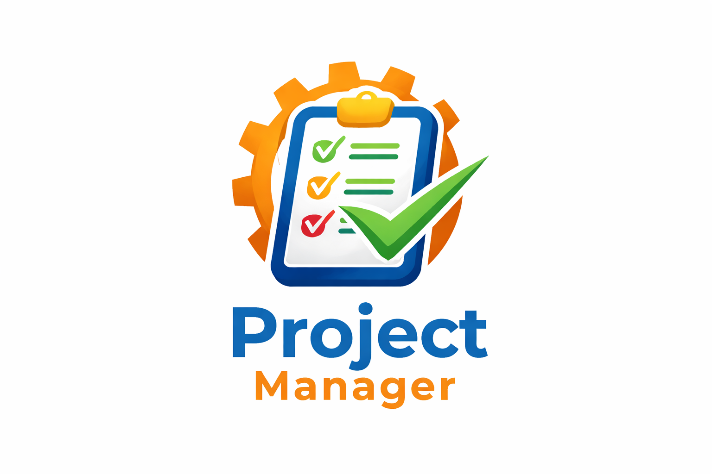
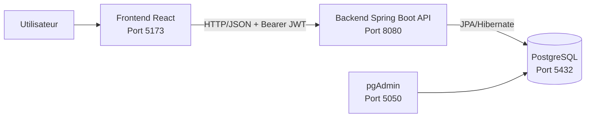
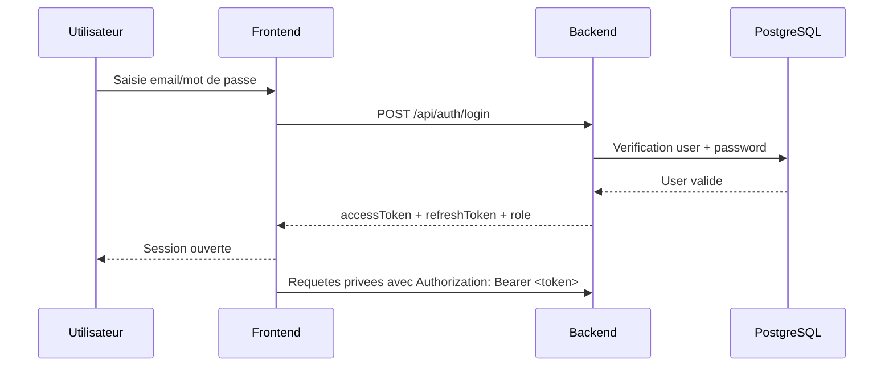
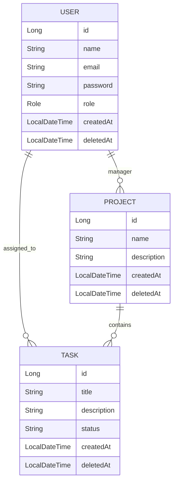

<p align="center">
  
</p>

<h1 align="center">Project Manager</h1>

<p align="center">
  Plateforme web de gestion de projets, utilisateurs et tickets, avec controle d'acces par roles.
</p>

---

## 1. Presentation du projet

**Project Manager** est une application full-stack pour piloter des projets en equipe:

- gestion des utilisateurs et des roles (`ADMIN`, `MANAGER`, `EMPLOYE`)
- creation et suivi des projets
- creation, affectation et suivi des taches (tickets)
- authentification JWT securisee
- historique de suppression (soft delete) avec restauration

Le projet est compose de:

- un **frontend React** (Vite) pour l'interface utilisateur
- un **backend Spring Boot** (API REST)
- une **base PostgreSQL**
- **Docker Compose** pour l'orchestration locale

---

## 2. Architecture globale



### Comment les composants communiquent

1. L'utilisateur interagit avec le frontend (`http://localhost:5173`).
2. Le frontend appelle le backend (`http://localhost:8080/api/...`).
3. Le backend valide les droits (Spring Security + JWT).
4. Le backend lit/ecrit les donnees dans PostgreSQL.
5. Le backend retourne une reponse JSON au frontend.

---

## 3. Schema de fonctionnement (authentification)



---

## 4. Stack technique

### Frontend

- React
- Vite
- JavaScript
- CSS (UI custom)

### Backend

- Java 21
- Spring Boot 4
- Spring Security (JWT stateless)
- Spring Data JPA / Hibernate
- Maven

### Base de donnees

- PostgreSQL 15
- pgAdmin 4 (optionnel, inspection visuelle)

### Qualite / CI

- Tests integration backend (H2 in-memory)
- GitHub Actions CI: `.github/workflows/backend-ci.yml`

---

## 5. Structure du repository

```text
project-management-system/
├─ Frontend/                         # Application React
├─ project-management-backend/       # API Spring Boot
├─ images/                           # Assets (logo)
├─ .github/workflows/backend-ci.yml  # CI backend
├─ docker-compose.yml                # Orchestration locale
└─ README.md                         # Documentation globale
```

---

## 6. Roles et permissions metier

### ADMIN

- cree des utilisateurs
- change les roles (`ADMIN`, `MANAGER`, `EMPLOYE`)
- supprime/restaure des utilisateurs
- voit tous les projets et toutes les taches

### MANAGER

- cree des projets
- cree des taches dans ses projets
- affecte des taches a des employes
- supprime/restaure des projets et taches de son perimetre

### EMPLOYE

- consulte ses taches
- change le statut de **ses propres** tickets uniquement
- consulte/edite son profil et son mot de passe

---

## 7. Parcours fonctionnel principal

1. L'admin se connecte.
2. L'admin cree un manager (ou met a jour un role).
3. Le manager se connecte et cree un projet.
4. Le manager cree des taches et les assigne a des employes.
5. L'employe se connecte et met a jour l'etat de ses tickets (`TODO`, `IN_PROGRESS`, `DONE`).
6. Les operations de suppression passent par l'historique (restauration possible).

---

## 8. Frontend: pages principales

### Pages publiques

- `/login`
- `/register`

### Pages privees

- `/dashboard`
- `/profile`

### Gestion utilisateurs (admin)

- `/users/list`
- `/users/create`
- `/users/deleted`

### Gestion projets

- `/projects/list`
- `/projects/create` (manager)
- `/projects/deleted`

### Gestion taches

- `/tasks/board`
- `/tasks/create` (manager)
- `/tasks/by-user`
- `/tasks/deleted`

---

## 9. Backend API - reference rapide

Base URL: `http://localhost:8080`

### 9.1 Auth

- `POST /api/auth/register` (public)
- `POST /api/auth/login` (public)
- `POST /api/auth/refresh?refreshToken=...` (public)
- `GET /api/auth/me` (authentifie)

Exemple body login:

```json
{
  "email": "admin@pms.local",
  "password": "admin123"
}
```

### 9.2 Utilisateurs

- `POST /api/users?role=ADMIN|MANAGER|EMPLOYE` (ADMIN)
- `PUT /api/users/{id}/role?role=...` (ADMIN)
- `GET /api/users` (ADMIN)
- `GET /api/users/deleted` (ADMIN)
- `GET /api/users/options` (ADMIN/MANAGER/EMPLOYE)
- `DELETE /api/users/{id}` (ADMIN)
- `PUT /api/users/restore/{id}` (ADMIN)
- `GET /api/users/me` (authentifie)
- `PUT /api/users/me` (authentifie)
- `PUT /api/users/me/password` (authentifie)

Exemple body update profil:

```json
{
  "name": "Nouveau Nom",
  "email": "nouveau.email@example.com"
}
```

### 9.3 Projets

- `POST /api/projects` (MANAGER)
- `GET /api/projects` (ADMIN/MANAGER)
- `GET /api/projects/deleted` (ADMIN/MANAGER)
- `DELETE /api/projects/{id}` (ADMIN/MANAGER)
- `PUT /api/projects/restore/{id}` (ADMIN/MANAGER)

Exemple body creation projet:

```json
{
  "name": "Projet CRM",
  "description": "Migration CRM interne"
}
```

### 9.4 Taches

- `POST /api/tasks?projectId={id}&userId={id}` (MANAGER)
- `GET /api/tasks` (ADMIN/MANAGER/EMPLOYE)
- `GET /api/tasks/deleted` (ADMIN/MANAGER)
- `GET /api/tasks/user/{userId}` (ADMIN/MANAGER/EMPLOYE)
- `DELETE /api/tasks/{id}` (ADMIN/MANAGER)
- `PUT /api/tasks/restore/{id}` (ADMIN/MANAGER)
- `PATCH /api/tasks/{id}/status?status=TODO|IN_PROGRESS|DONE` (EMPLOYE)

Exemple body creation tache:

```json
{
  "title": "Creer ecran login",
  "description": "Faire page login React",
  "status": "TODO"
}
```

> Documentation backend detaillee:
> `project-management-backend/README.md`

---

## 10. Modele de donnees (simplifie)



---

## 11. Lancement rapide avec Docker

Depuis la racine du projet:

```bash
docker compose up --build -d
```

### URLs utiles

- Frontend: `http://localhost:5173`
- Backend API: `http://localhost:8080`
- pgAdmin: `http://localhost:5050`
- PostgreSQL: `localhost:5432`

### Credentials par defaut (compose actuel)

- Admin app:
  - email: `admin@pms.local`
  - password: `admin123`
- pgAdmin:
  - email: `admin@gmail.com`
  - password: `admin`
- PostgreSQL:
  - user: `admin`
  - password: `admin`
  - db: `projectdb`

---

## 12. Variables d'environnement importantes

Dans `docker-compose.yml` (service backend):

- `SPRING_DATASOURCE_URL`
- `SPRING_DATASOURCE_USERNAME`
- `SPRING_DATASOURCE_PASSWORD`
- `JWT_SECRET`
- `APP_ADMIN_EMAIL`
- `APP_ADMIN_PASSWORD`
- `APP_ADMIN_NAME`
- `APP_CORS_ALLOWED_ORIGINS`

---

## 13. Lancer les tests backend

Depuis `project-management-backend/`:

```bash
./mvnw clean test
```

PowerShell (Windows):

```powershell
.\mvnw.cmd clean test
```

Rapports:

```text
project-management-backend/target/surefire-reports
```

---

## 14. CI GitHub

Le workflow backend est dans:

```text
.github/workflows/backend-ci.yml
```

Il execute automatiquement:

- checkout
- Java 21
- `./mvnw -B clean test`

sur `push` et `pull_request` (quand le backend est impacte).

---

## 15. Bonnes pratiques d'utilisation

- Toujours envoyer `Authorization: Bearer <accessToken>` sur les routes privees.
- Pour les routes avec `@RequestParam`, passer les params dans l'URL.
- Respecter les roles metier (ex: creation de projet reservee MANAGER).
- Utiliser les pages `deleted` pour restaurer au lieu de suppression definitive.

---

## 16. Etat actuel du projet

Le projet est pret pour:

- developpement local
- validation fonctionnelle complete
- execution des tests backend
- integration continue backend (GitHub Actions)

Si tu veux, je peux aussi te generer une **documentation Swagger/OpenAPI** pour avoir une spec API interactive.
